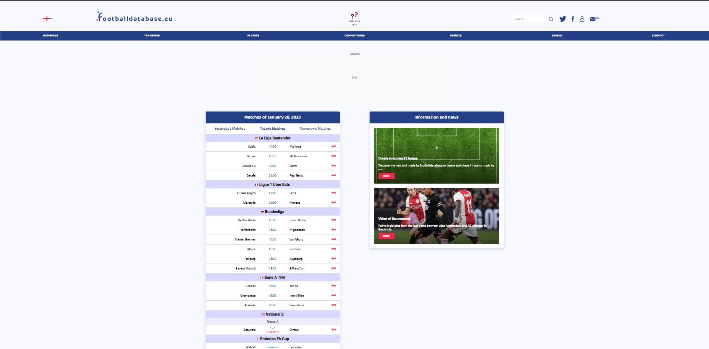
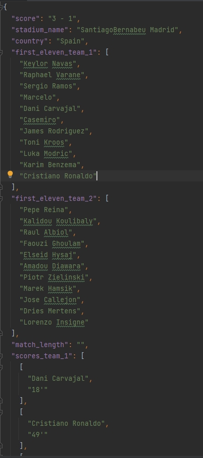
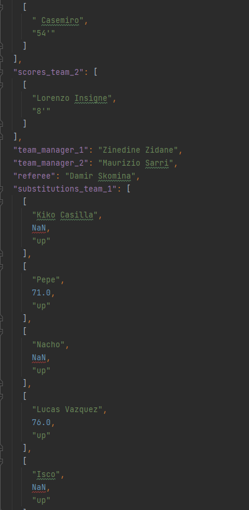
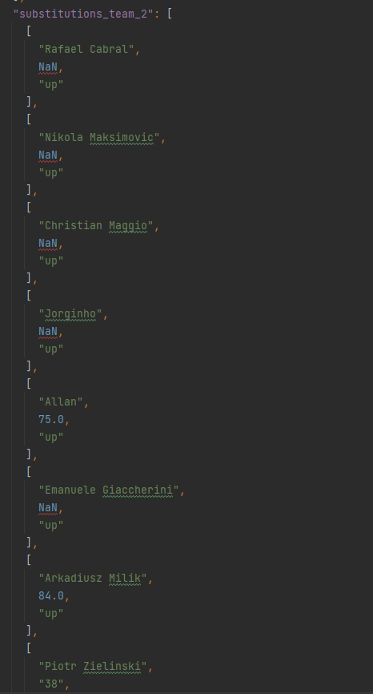
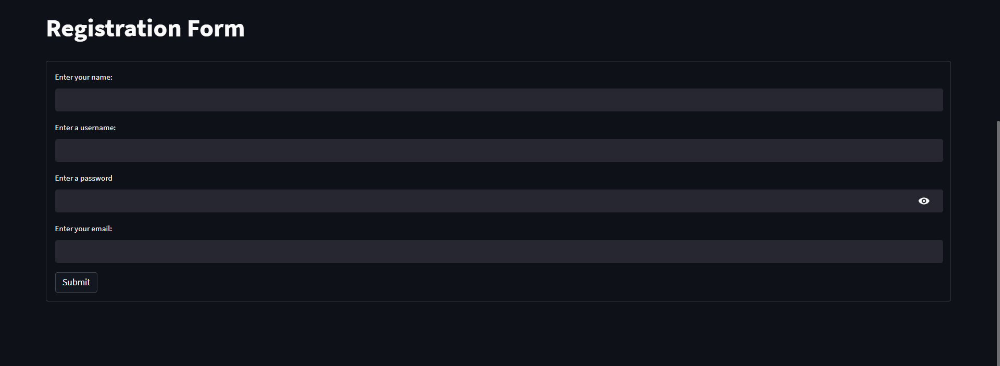

# Scrapper Module

## Description
This module aims to perform data scrapping from the web
page in order to retrieve event and context data for a given match data.
The primary data that will be extracted is:  
1. Score
2. Stadium name
3. Country where the match took place
4. Who scored and at what time
5. First eleven players of both teams
6. Substitutions from both teams
7. Teams' managers
8. Referee surname and firstname

The scrapper module has been incorporated into the application
but may perform its functionality on its own, scrapping the data
without the necessity of the GUI.

## Prerequisites and requirements
In order to the scrapper module to function as a standalone module
all the modules from the *requirements.txt* located in the Scrapper folder.  
Not all the requirements needed to run the application are necessary to run
the scrapper. After installing the *requirements.txt* please make sure that
you have the latest version of Google Chrome browser installed and that
you have a connection to the internet.

## Tools
Two main libraries have been implemented in the development of the Scrapper:  
1. Selenium - an open source umbrella project for a range of tools and libraries aimed at supporting browser automation.[3] It provides a playback tool for authoring functional tests across most modern web browsers.
2. BeautifulSoup - a Python package for parsing HTML and XML documents. It creates a parse tree for parsed pages that can be used to extract data from HTML, which is useful for web scraping.
3. Python - all the executive code has been written in python (ver. 3.10).

## Usage
If the scrapper is used from the GUI, the user should provide the appropriate data in the left panel and press
**Scrap Data** button. The scrapper will then proceed to start its process.  
If the scrapper is to be run as a standalone process the following command should be run (from the root directory of the Scrapper module):  
`python execute_scrapper.py <arguments>`  
With the list of arguments:  
- `-date` : date when the match took place.
- `-team1`: name of the first team.
- `-team2`: name of the second team.  
**Note**. The scrapper is not case-sensitive, nor is it encoding-sensitive
(it maps into unicode) and it is resistant to spaces (team names may contain spaces).  
**But** it is not resistant to misspellings in the data or, in general,
writing the name of the team not in accordance with its official name.  
To find the official names of the teams, one can visit the following websites:  
- [Club football list](https://footballdatabase.com/ranking/world)
- [National football list](https://en.wikipedia.org/wiki/List_of_men%27s_national_association_football_teams).

## Scrapping process
Mainly two files are responsible for the entire process of scrapping, namely:

- [Execute_all](https://github.com/michalpiasecki0/BSc-soccer-annotator/blob/main/Scrapper/execute_scrapper.py) - script that executes all the functionalities.
- [footballdatabase_eu_scrapper.py](https://github.com/michalpiasecki0/BSc-soccer-annotator/blob/main/Scrapper/footballdatabase_eu_scrapper.py) - script that connects to the database, retrieves link and data. 

## Scrapped resources
The resources are being scrapped from the page [Footballdatabase.eu](https://www.footballdatabase.eu/en/).  
FootballDatabase.eu is a comprehensive website that contains a vast amount of football match data. The site includes 
information on teams, players, matches, and statistics from various leagues and competitions around the world. Users can
access detailed statistics and information on past, current, and upcoming matches, as well as historical data on teams 
and players. The website offers a user-friendly interface that makes it easy to search and navigate the extensive 
database. Overall, FootballDatabase.eu is an invaluable resource for football fans and researchers who are looking for 
comprehensive and accurate information on the sport.  
Ultimately only one webpage (containing the vastest amount of resources) has been used in order to speed up the scrapper.  
The example image of the home page:

## Results
Currently, the scrapper is evaluated on the data consisting of 24 match inputs from the aforementioned webpage.
The main metric being evaluated is time it takes for a function that makes up the scrapper to execute. Should the data about the match be given
correctly, all the data will be retrieved (it has been tested), the completeness (how much data has been retrieved if it was provided on the webpage to all data expected)
has always been 1.  
Data to the testing phase has been extracted is located in [test_scrapper.py](https://github.com/michalpiasecki0/BSc-soccer-annotator/blob/main/Scrapper/test_scraper.py)

| Test              | Average time (seconds) | Standard derivation (seconds) |
|-------------------|------------------------|-------------------------------|
| test_session_init | < 0.001                | < 0.001                       |
| test_get_cookies   | < 0.001                | < 0.001                       |
| test_get_game_id_and_href   | 35.06                  | 12.45                         |
| test_save_to_JSON   | 1.05                   | 0.04                          |
| test_get_data_from_link   | 2.04                   | 1.02                          |

## Saved data structure
Saved data from the scrapper is transferred into a folder structure
that contains data about the match. The scrapped data is saved upon
such a data structure in a form of a JSON file that contains all the information.  
The folder structure in our application takes the following form:  
- maches
    - match_string
        - annotations
            - annotation_type_1
            - annotation_type_2
            - annotation_type_3
            - annotation_type_4
            - annotation_type_5
            - ...
        - scrapped_data.json
        - video.mp4

Where matches is a folder containing all matches (which are represented by a folder).  
Match_string - a specific string that identifies a match in a form of : date_team1_team2  
Annotations - folder containing all annotated data
Scrapped_data.json - JSON file that contains all scrapped data in JSON.
Video.mp4 - video of a given match.  
The scrapper creates the scrapped_data.json file in the folder structure. The following images contain the structure of the 
file given in a example.

## User authentication and database
Besides the scrapper module, the application has an implemented user authentication module that is connected to an external cloud database
that provides with up to 10GB of free storage and performs password hashing to retain the passwords safe.  
The service in question is Deta: 
[Deta](https://www.deta.sh/)  
Deta is a cloud-based internet service that allows users to easily access, store, and process
data in a variety of formats. It utilizes a variety of technologies, such as serverless computing, to provide a scalable
and cost-effective solution for data management. Deta features a web-based user interface for easy data management,
as well as a robust API for programmatic access to data. Additionally, Deta supports a wide range of data sources,
including SQL databases, NoSQL databases, and file storage systems, making it a versatile solution for data management.
Deta also provides tools for data processing and analysis, such as SQL query and Python scripting, for data visualization,
and for machine learning. Overall, Deta aims to provide a simple and efficient way for users to manage and make sense of their data.  
The data that is being stored in the database is user's credentials, namely:  
- username (key hence must be unique)
- name of the user
- password (hashed)
- email  
User inputs their credentials in the registration form, that is defined in the ui, namely here: [Registration form](https://github.com/michalpiasecki0/BSc-soccer-annotator/blob/main/ui/ui_streamlit.py#L1082).  
.  
After successfully creating the account, user may login, with the login form, which is located here: [Login form](https://github.com/michalpiasecki0/BSc-soccer-annotator/blob/main/ui/ui_streamlit.py#L68).  
All the defined modules that implement communication with the database are located here: [Database utilities](https://github.com/michalpiasecki0/BSc-soccer-annotator/blob/main/Scrapper/database.py).  
Because Deta is a cloud service, there is no need to install any additional software, only a python module is required, which
has been issued in *requirements.txt*.  

