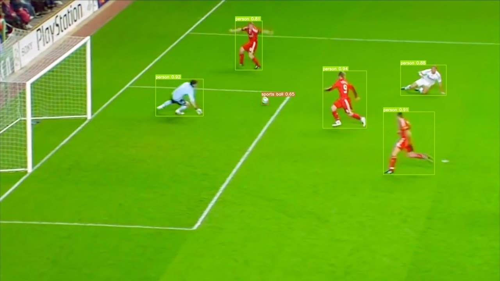
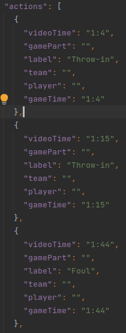

# Automatic models module

## Description
This module aims to automatize annotations for football video matches.
In particular it automatizes following tasks:
1. Player and ball detection
2. Event Annotation
3. Field lines detection
4. Football field segmentation

It can be used as a standalone module or be incorporated into other code (E.g into GUI `ui/ui_streamlit`)

## Usage prerequisities
In order to use this module make sure, you have completed installation steps mentioned on [main page](https://github.com/michalpiasecki0/BSc-soccer-annotator)

What's more make sure you have placed model weights in correct folders, in particular:
1. Download [out.zip](https://drive.google.com/uc?id=1kgc6wfgdIDsHBhFMAr6YwTWbrigNv_UB&export=download) and extract it in [BSc-soccer-annotator/automatic_models/lines_and_field_detection/out](https://github.com/michalpiasecki0/BSc-soccer-annotator/tree/main/automatic_models/lines_and_field_detection/out) folder.
2. Download [yolov7.pt](https://github.com/WongKinYiu/yolov7/releases) and place it in [automatic_models/object_detection/yolo](https://github.com/michalpiasecki0/BSc-soccer-annotator/tree/main/automatic_models/object_detection/yolo)

## Usage

General interface between models and user is provided with [main.py](https://github.com/michalpiasecki0/BSc-soccer-annotator/blob/main/automatic_models/main.py). Function responsible for API is <perform_models>. User can use this script in two ways:
1. run script from CLI with arguments
2. modify function in lines (88-98) and run it without arguments

### Running from CLI

User can run script with following command (make sure you run it from root directory (BSc-soccer-annotator)):
`python main.py <arguments>`

List of possible arguments:  
`-in` `--video_path`: direct/relative path to video to be analyzed  
`-out` `--output_path`: Path to folder where all results from models should be saved  
`-freq` `--frequency`: Frequency for dividing video for models (E.g 2, means that video will be divided each 0.5 sec.)  
`-start` `--starting_poing`: Models will start dividing video and provide  
`-save` `--saving_strategy`: Choose from add/overwrite. If latter new predictions in same folder overwrite older ones.  
`-conf` `--models_config_path`: Path to json with own parameters for models  
`-p_e`, `--perform_events`: If True model will perform event annotation   
`-p_o`, `--perform_objects`: If True model will perform object detection  
`-p_lf`, `--perform_lines_fields`: If True model will perform field segmentation and lines detection  

To get more details about arguments (E.g which are required/optional) go to [main.py](https://github.com/michalpiasecki0/BSc-soccer-annotator/blob/main/automatic_models/main.py) lines (9-30)  

Example run:
`python automatic_models/main.py --video_path automatic_models/data/not_on_repo/videos/output_5min.mp4 --output_path ./data/test_22_01/ --frequency 0.05 --starting_point 0 --saving_strategy overwrite --models_config_path automatic_models/data/configs/basic_config.json --perform_events true --perform_objects true --perform_lines_fields true`
`

If someone doesn't want to run script from CLI, one can also modify function parameters and run it from IDE.

## General package overview
Here, I provide general descrption for most important files/folders in `automatic_models`  
[main.py](https://github.com/michalpiasecki0/BSc-soccer-annotator/blob/main/automatic_models/main.py): API for automatic models  
[handlers.py](https://github.com/michalpiasecki0/BSc-soccer-annotator/blob/main/automatic_models/handlers.py): implementation of handlers, which take care of high-level interaction between video,images and models  
[object_detection](https://github.com/michalpiasecki0/BSc-soccer-annotator/tree/main/automatic_models/object_detection): implementation of Players, Ball detection  
[lines_and_field_detection](https://github.com/michalpiasecki0/BSc-soccer-annotator/tree/main/automatic_models/lines_and_field_detection): implementation of field annotation and lines detection  
[event_annotation](https://github.com/michalpiasecki0/BSc-soccer-annotator/tree/main/automatic_models/event_annotation): implementation of event annotation   
[model_tests](https://github.com/michalpiasecki0/BSc-soccer-annotator/tree/main/automatic_models/models_tests): implemtation of tests for models  

## Models
This is short description of each models with references to files:
### Player and ball detection
#### Short description
This module aims to find all players and ball on a given image and put them in rectangles.
#### Module description
This part is implemented in [object_detection](https://github.com/michalpiasecki0/BSc-soccer-annotator/tree/main/automatic_models/object_detection).
In particular [object_detector.py](https://github.com/michalpiasecki0/BSc-soccer-annotator/blob/main/automatic_models/object_detection/object_detector.py)
is responsible for handling players and balls detection for each video frame. Current architecture (YOLOv7) is writen in [yolo](https://github.com/michalpiasecki0/BSc-soccer-annotator/tree/main/automatic_models/object_detection/yolo) folder
#### Architecture
[YOLOv7](https://github.com/WongKinYiu/yolov7) is currently used to handle this topic. For more details, you can read [article](https://arxiv.org/abs/2207.02696).
#### Example result

### Field lines detection & Football field segmentation
#### Short description
Field lines detection aims to find extremities for all lines on an image. List of possible lines is stored in [lines_coordinates.json](https://github.com/michalpiasecki0/BSc-soccer-annotator/blob/main/automatic_models/lines_and_field_detection/data/lines_coordinates.json). Field segmentation aims to segment pixels belonging to football field and inscribe it into polygon.
Although both tasks are declared seperately, in my final approach I used architecture, which handles both tasks at once. My first attempts to solve this topic were focused on methods from classic image processing. In paritcular for Field Segmentation I tried to segment field with masking green pixels and using Convex Hull, and for Line Detection I tried to ue Hough Line Transform with Canny Detector. These first attempts can be found in [deprecated](https://github.com/michalpiasecki0/BSc-soccer-annotator/tree/main/automatic_models/deprecated) folder. Unfortunately these attempts were not fruitful.
At the end, I decided to use approach based on homography calculation.
#### Module description 
This part is implemented in [lines_and_field detection](https://github.com/michalpiasecki0/BSc-soccer-annotator/tree/main/automatic_models/lines_and_field_detection). In particular [lines__field_detector.py](https://github.com/michalpiasecki0/BSc-soccer-annotator/blob/main/automatic_models/lines_and_field_detection/lines_and_field_detector.py) is responsbile for handling all operations used in these tasks.
It is reponsible for calling model to calculate homography matrix. Having homography matrix, it performs mapping linepoints from template into video frame and calculating football field polygon. Other directories in [lines_and_field_detection](https://github.com/michalpiasecki0/BSc-soccer-annotator/tree/main/automatic_models/lines_and_field_detection) are responsible for implementation of model for homography calculation.
#### Architecture
Architecture for homography calculation is [Optimization based Image Registration](https://github.com/vcg-uvic/sportsfield_release). Interestingly, authors of this work, use two deep network models in decoupled fashion. First model is used to estimate homography matrix, and second model is used to regress error after original and projected image are warped.
#### Example result

### Event Annotation
#### Short description
Event annotation aims to analyze video and find occurences of particular events during video match (E.g Faul, Goal, etc).
This task was really challenging for me, so I decided to just use architecture proposed by [Soccernet](https://github.com/SoccerNet): [CALF](https://github.com/SoccerNet/sn-spotting/tree/main/Benchmarks/CALF)
#### Module description
This part is implemented in [event_annotation](https://github.com/michalpiasecki0/BSc-soccer-annotator/tree/main/automatic_models/event_annotation) folder.
#### Architecture 
Description can be found here: [CALF](https://github.com/SoccerNet/sn-spotting/tree/main/Benchmarks/CALF)
#### Example result

## Results

Currently, models were tested on two folders, each containing 35 photos.
Here are the results of best models:

| Metric          | acc@5         | acc@10 | acc@20   | acc@30  | IOU players | Players detection ratio | Balls detection ratio   | 
| -----------     | -----------   | ------ | -----    |   ----  |   -----     |     ------------        |     --------------      |
| 2019-05-france  |   0.35        | 0.55   |   0.78   |   0.84  |   0.77      |        469 / 491          |       7 / 22          |
| Barcelona Eibar |   0.18        | 0.43   |   0.71   |   0.81  |   0.79      |        297 / 325          |       1 / 19          |

Metrics description:
1. `acc@x` - accuracy for line extremities, point is considered true positive, if lies in distance smaller than `x` to ground truth point
2. `IOU` - intersection over union. Used in object detection, having two bounding boxes (predicted and ground truth), calculates their intersection 
divided by union
3. `detection ratio`: calculates number of detected instances divided by all ground truth instances

These results can be found in following folders:
1. [2019-05-france](https://github.com/michalpiasecki0/BSc-soccer-annotator/tree/main/automatic_models/models_tests/data/2019-05-france/results_optim_200)
2. [Barcelona Eibar](https://github.com/michalpiasecki0/BSc-soccer-annotator/tree/main/automatic_models/models_tests/data/2017-05-21%20-%2021-00%20Barcelona%204%20-%202%20Eibar/results_optim_200)

