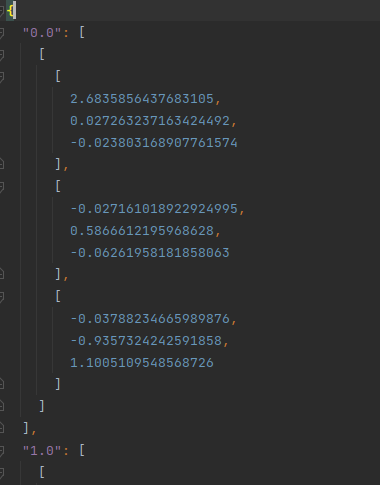
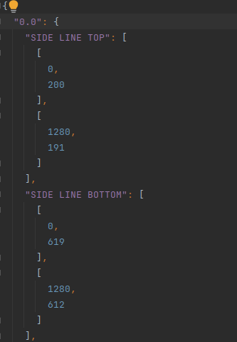
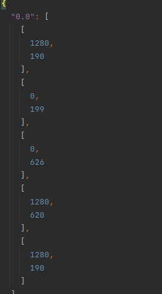
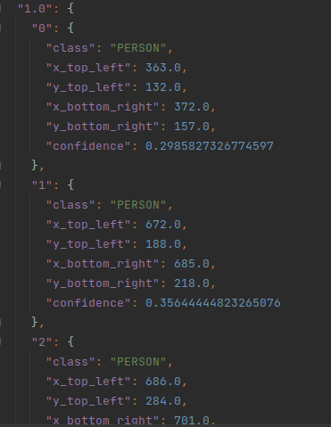

## FORMATY JSONÓW

### HOMOGRAPHIES

Kazda klatka jest zapisana jako oddzielny obiekt do jsona.
Kluczem kazdej klatki jest czas w sekundach od rozpoczecia video 
(na przykladzie: 0.0 to odrazu po wlaczeniu video, a 1.0 to klatka po pierwszej sekundzie).
Wartoscia dla kazdej klatki jest lista o rozmiarze (3,3) zawierajaca macierz homografii
przenoszacej obraz z template'u na daną klatke video

### LINES
Kazda klatka jest zapisana jako oddzielny obiekt do jsona.
Kluczem kazdej klatki jest czas w sekundach od rozpoczecia video.
Dla kazdej klatki mamy slownik zawierajacy znalezione linie wraz z ich koncowymi wspolrzednymi, np.
"{MIDDLE_LINE: [[x1, y1], [x2, y2]]}"
Lista mozliwych linii wraz z ich wspolrzednymi na templacie znajduje sie w oddzielnym jsonie.

### FIELDS
Kazda klatka jest zapisana jako oddzielny obiekt do jsona.
Kluczem kazdej klatki jest czas w sekundach od rozpoczecia video.
Dla kazdej klatki mamy listę punktow definiujacych wielokat opisujacy boisko tzn [[x1, y1], [x2, y2] ..., [xn, yn]]

## OBJECTS

Kazda klatka jest zapisana jako oddzielny obiekt do jsona.
Kluczem kazdej klatki jest czas w sekundach od rozpoczecia video
(jak wyzej). Dla kazdej sekundy jest tworzony slownik z obiektami.
KLuczami sa kolejne id obiektow, a wartoscia obiekt zdefiniowany przez pola
class: PERSON LUB SPORTSBALL
x_top_left, y_top_left, x_bottom_right, y_bottom_right: wspolrzedne dwoch punktow dla bounding boxa
confidence: pewnosc modelu

